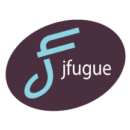

JFugue: Java API for Music Programming
============



JFugue encourages people of all ages to experiment with the expressive power of music.
Generate musical data interactively or algorithmically, use musical patterns, rhythms,
elements of music theory, including chords and chord progressions, communicate to external
MIDI devices, such as musical keyboards, mixers and more. 


__Create music with only a few lines of code!__
```java
import org.jfugue.player.Player;

public class HelloWorld {
  public static void main(String[] args) {
    Player player = new Player();
    player.play("C D E F G A B");
  }
}
```

For documentation see [JFugue API][1].


Download
--------

Download [the latest JAR][2]:


License
-------

    The content of the JFugue website is copyright © 2002-2015 David Koelle. All rights reserved.

    The JFugue source code is licensed under the Apache License version 2.0:
    
     Licensed under the Apache License, Version 2.0 (the "License");
     you may not use this file except in compliance with the License.
     You may obtain a copy of the License at
 
       http://www.apache.org/licenses/LICENSE-2.0
 
     Unless required by applicable law or agreed to in writing, software
     distributed under the License is distributed on an "AS IS" BASIS,
     WITHOUT WARRANTIES OR CONDITIONS OF ANY KIND, either express or implied.
     See the License for the specific language governing permissions and
     limitations under the License.
    
 


 
 [1]: http://www.jfugue.org/doc/index.html
 [2]: http://www.jfugue.org/jfugue-5.0.1.jar
